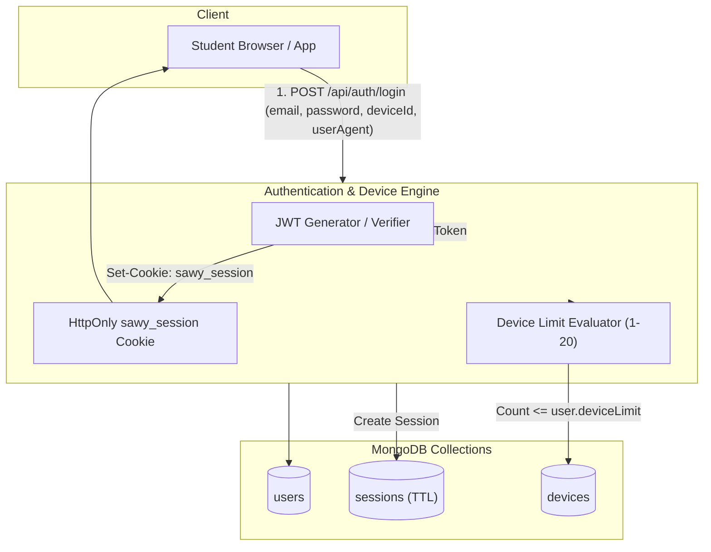
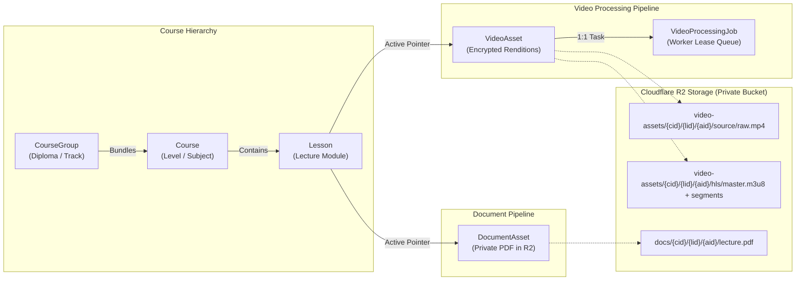
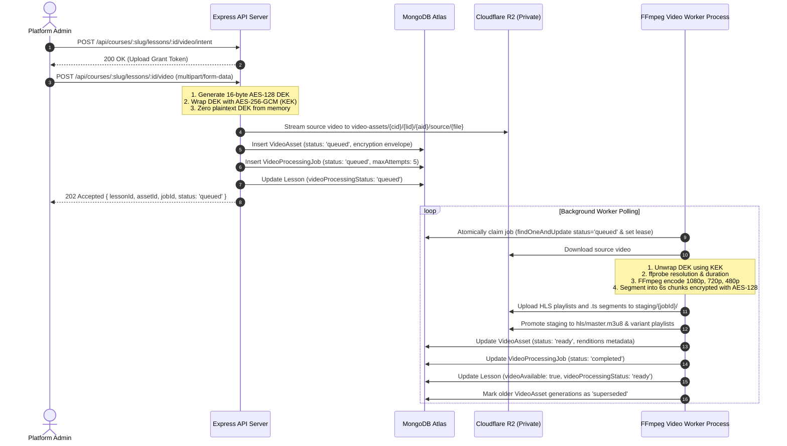
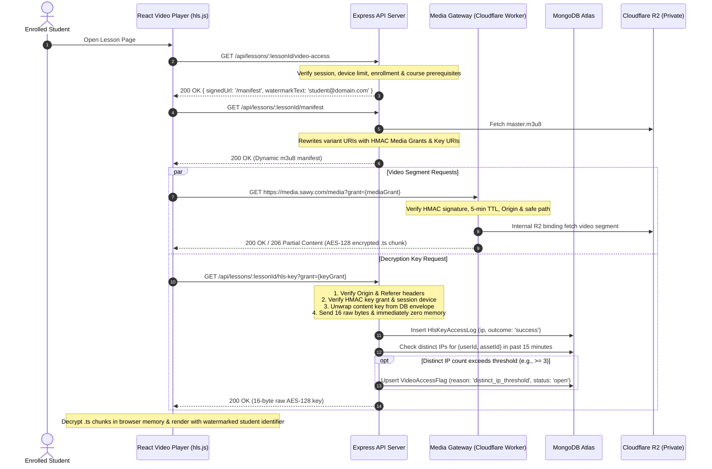
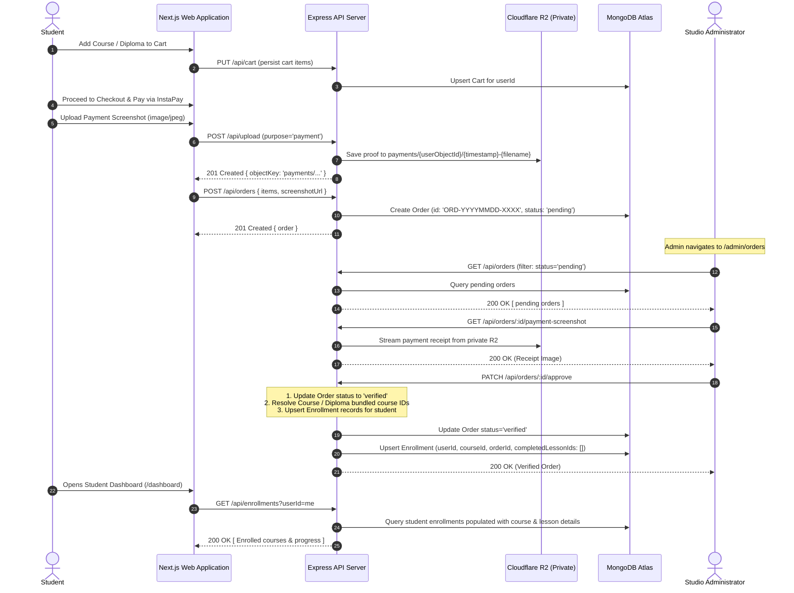
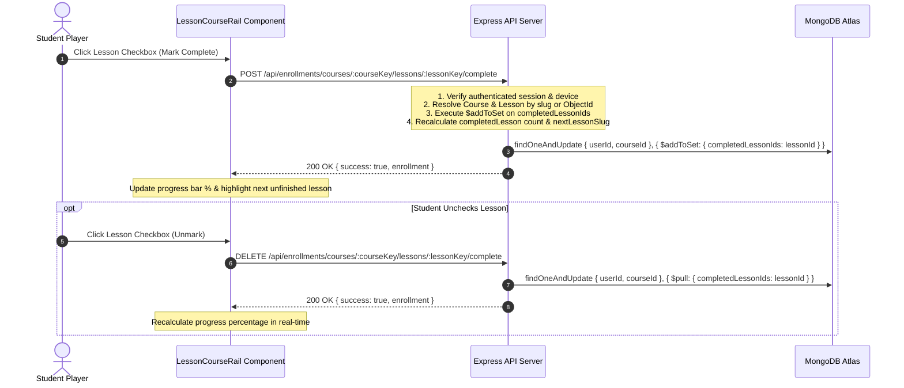

# Sawy Academy — Database Diagrams & System Data Flows

This document contains visual architectural diagrams for **Sawy Academy**, including the complete **Entity-Relationship Diagram (ERD)**, domain-specific relationship models, and **Data Flow Diagrams (DFDs)** explaining critical business workflows.

---

## 1. Master Entity-Relationship Diagram (ERD)

The following Mermaid diagram depicts all 21 models, foreign key relationships, embedded subdocuments, and cardinality across the platform.

```mermaid
erDiagram
    %% ==========================================
    %% IDENTITY & ACCESS CONTROL
    %% ==========================================
    User ||--o{ Session : "has active"
    User ||--o{ Device : "registers"
    User ||--o{ Enrollment : "enrolls in"
    User ||--o{ Order : "places"
    User ||--o| Cart : "owns"
    User ||--o{ ServiceRequest : "submits"
    User ||--o{ VideoAccessFlag : "flagged on"
    User ||--o{ HlsKeyAccessLog : "generates key logs"
    
    Session ||--o{ HlsKeyAccessLog : "audits"

    User {
        ObjectId _id PK
        string name
        string email UK
        string passwordHash
        string role "admin | student"
        string avatarUrl
        number deviceLimit "1..20"
        date createdAt
        date updatedAt
    }

    Session {
        ObjectId _id PK
        string token UK
        ObjectId userId FK
        string deviceId
        date lastActiveAt
        date expiresAt "TTL Index"
    }

    Device {
        ObjectId _id PK
        ObjectId userId FK
        string deviceId
        string label
        string userAgent
        date lastActiveAt
    }

    %% ==========================================
    %% LMS & LESSON ASSET PIPELINE
    %% ==========================================
    CourseGroup ||--o{ Course : "bundles"
    Course ||--o{ Lesson : "contains"
    Course ||--o{ Enrollment : "enrolled by"
    Course ||--o{ VideoAsset : "owns assets"
    Course ||--o{ DocumentAsset : "owns docs"
    Course ||--o{ Product : "recommends"

    Lesson ||--o| VideoAsset : "active video"
    Lesson ||--o| DocumentAsset : "active document"
    Lesson ||--o{ VideoProcessingJob : "processes"
    Lesson ||--o{ VideoAccessFlag : "subject of flag"
    Lesson ||--o{ HlsKeyAccessLog : "target of log"

    Course {
        ObjectId _id PK
        string id UK
        string slug UK
        string title
        string description
        string level
        string instructor
        string price
        string image
        ObjectId[] lessons FK
        ObjectId[] relatedProductIds FK
    }

    CourseGroup {
        ObjectId _id PK
        string title
        string subtitle
        string type "diploma | leveled"
        string image
        ObjectId[] courses FK
        string bundlePrice
    }

    Lesson {
        ObjectId _id PK
        string id UK
        string slug
        string title
        string sheetRef
        string duration
        number order
        string summary
        string content
        boolean videoAvailable
        ObjectId videoAssetId FK
        string videoProcessingStatus
        boolean documentAvailable
        ObjectId documentAssetId FK
    }

    Enrollment {
        ObjectId _id PK
        ObjectId userId FK
        ObjectId courseId FK
        ObjectId orderId FK
        ObjectId[] completedLessonIds FK
        date createdAt
    }

    VideoAsset {
        ObjectId _id PK
        ObjectId lessonId FK
        ObjectId courseId FK
        number generation
        string status "uploading | queued | processing | ready | failed | superseded"
        object source
        string outputPrefix
        string masterPlaylistObjectKey
        object encryption "AES-128 wrapped envelope"
        object media "duration, dimensions, codecs"
        object[] renditions "1080p, 720p, 480p"
        date readyAt
    }

    VideoProcessingJob {
        ObjectId _id PK
        ObjectId assetId FK,UK
        ObjectId lessonId FK
        string status "queued | processing | retry_wait | completed | failed"
        number attempts
        number maxAttempts
        date availableAt
        object lease "ownerId, expiresAt, heartbeatAt"
    }

    DocumentAsset {
        ObjectId _id PK
        ObjectId lessonId FK
        ObjectId courseId FK
        number generation
        string status "ready | superseded | failed"
        string objectKey
        string filename
        string contentType
        number sizeBytes
    }

    %% ==========================================
    %% SECURITY AUDIT & ABUSE DETECTION
    %% ==========================================
    VideoAccessFlag {
        ObjectId _id PK
        ObjectId userId FK
        string deviceId
        ObjectId lessonId FK
        ObjectId assetId FK
        string reasonCode "distinct_ip_threshold"
        string status "open | in_review | resolved | dismissed"
        number distinctIpCount
        number threshold
        number windowMinutes
        date firstDetectedAt
        date lastDetectedAt
        date expiresAt "TTL Index (180d)"
    }

    HlsKeyAccessLog {
        ObjectId _id PK
        ObjectId userId FK
        ObjectId sessionId FK
        string deviceId
        ObjectId lessonId FK
        ObjectId assetId FK
        string ip
        string outcome "success | denied | error"
        string reason
        date occurredAt
        date expiresAt "TTL Index (30d)"
    }

    %% ==========================================
    %% COMMERCE & ORDERS
    %% ==========================================
    Order ||--o{ Enrollment : "creates upon approval"
    
    Order {
        ObjectId _id PK
        string id UK
        ObjectId userId FK
        string userName
        string userEmail
        number amount
        string status "pending | verified | rejected"
        string paymentScreenshotUrl "private R2 key"
        object[] items
        date submittedAt
    }

    Cart {
        ObjectId _id PK
        ObjectId userId FK,UK
        object[] items
    }

    Product {
        ObjectId _id PK
        string id UK
        string name
        string description
        string price
        string category
        string image
        string[] gallery
    }

    ServiceRequest {
        ObjectId _id PK
        string name
        string email
        string type "design | research | device access"
        string status "pending | in review | accepted | rejected"
        string details
        object payload "includes referenceImageUrls"
        ObjectId userId FK
    }

    %% ==========================================
    %% CMS & SINGLETON CONFIGURATIONS
    %% ==========================================
    Project {
        ObjectId _id PK
        string id UK
        string slug UK
        string sheetRef UK "A-01 format"
        string title
        string category "Buildings | Interiors | Furniture | Competitions"
        string year
        string image
        string[] gallery
        number order
    }

    Research {
        ObjectId _id PK
        string id UK
        string slug UK
        string title
        string year
        string category "Published | Conference | Ongoing | Book"
        string venue
        string abstract
        string[] authors
        string doi
        string pdfUrl
        string externalUrl
        string[] keywords
    }

    Faq {
        ObjectId _id PK
        string id UK
        string question
        string answer
        string category
        boolean published
        number order
    }

    HomePage {
        ObjectId _id PK
        string key UK "home"
        object[] sections
    }

    SiteSettings {
        ObjectId _id PK
        string key UK "default"
        object branding "name, wordmark, InstaPay info"
        object seo "title, description, ogImageUrl"
        object navigation "items"
        object footer "links"
        map pageHeaders
        object contactPage
        object servicesPage
    }
```

---

## 2. Sub-Domain Architectural Diagrams

### 2.1 Identity, Session & Device Concurrency Sub-Domain

---

### 2.2 LMS & Protected Video Pipeline Sub-Domain

---

## 3. System Data Flow Diagrams (DFDs)

### 3.1 Data Flow 1: Video Upload, Worker Queue & AES-128 HLS Transcoding

---

### 3.2 Data Flow 2: Authenticated HLS Playback, Key Delivery & Anomaly Detection

---

### 3.3 Data Flow 3: E-Commerce Checkout, InstaPay Verification & Course Enrollment

---

### 3.4 Data Flow 4: Interactive Lesson Completion & Progress Tracking

